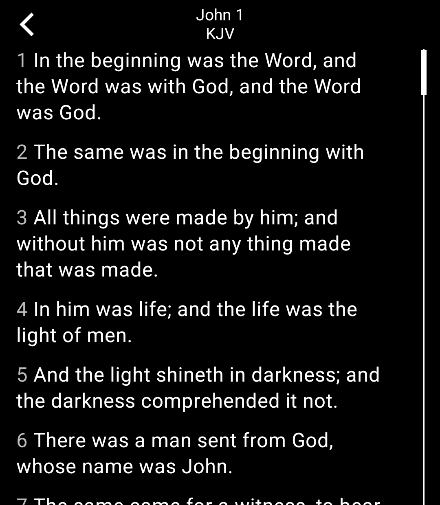
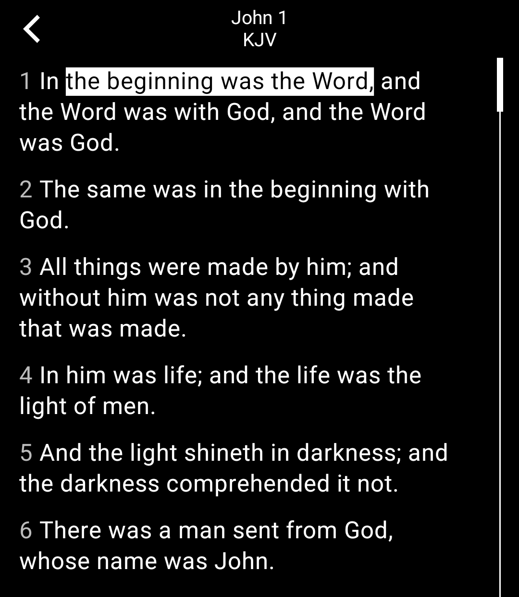
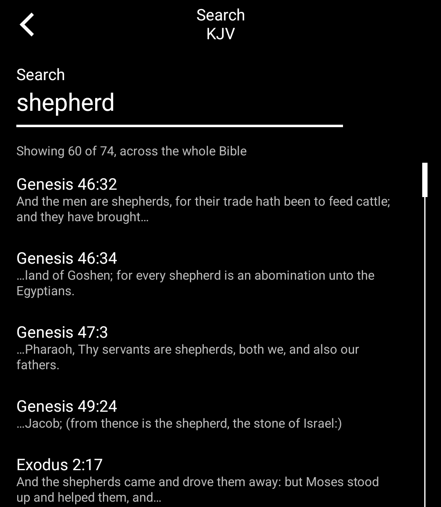
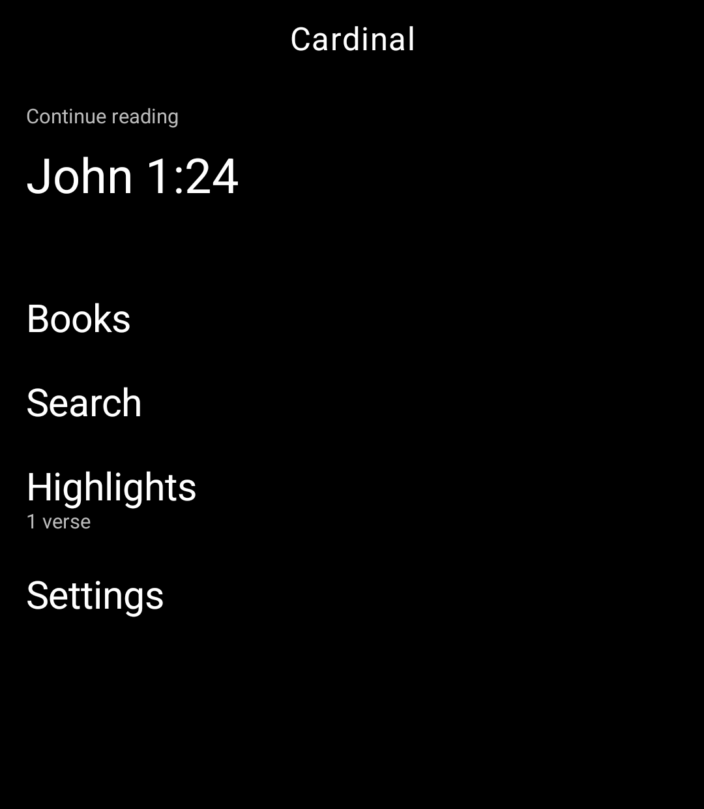

# Cardinal

A Bible reader for the Light Phone III. Pick a book, pick a chapter, read.
Tap a verse to highlight it. It remembers where you were.

That is the whole app. There is no AI, no memorization, no reading plan, no
account, no sync, no streaks, and no network call of any kind. Every verse of
all three translations ships inside the APK.

Search is offline too: it scans the bundled text directly rather than keeping
an index, so there is nothing to build on first run and nothing to migrate.

<p>
  
  
  
  
</p>

Cardinal is the reading half of [the iOS app of the same
name](https://apps.apple.com/app/cardinal), rebuilt from scratch for LightOS
rather than ported. The iOS app is SwiftUI; this is Kotlin and Compose against
the official [Light SDK](https://github.com/lightphone/light-sdk), and it
deliberately keeps only the part that belongs on a phone you bought in order to
use it less.

## Translations

| Code | Translation | Status |
| --- | --- | --- |
| KJV | King James Version | Public domain. The default. |
| WEB | World English Bible | Public domain. No permission needed to copy, quote, or print. |
| BSB | Berean Standard Bible | Dedicated to the public domain on 30 April 2023. Courtesy of [berean.bible](https://berean.bible/licensing.htm). |

Nothing copyrighted will ever be added. A licensed translation could not be
redistributed in an open-source repo that Light builds from a public commit,
and there is no network path here to stream one.

## Installing

Most likely you can't yet, and that is not a problem with this repo. Three
things stand between the APK below and a working tool on a phone.

**There is no browser on a Light Phone III.** Nothing gets downloaded on the
device. You download on a computer and push it over USB.

**Shipping LightOS builds may not run SDK tools at all.** As of Light's own
README, the builds in the wild are "not yet ready to play nice" with tools built
against this SDK. That notice still stands. Whether Cardinal launches on current
firmware is untested.

**These builds are not signed by Light.** They carry the SDK's `lightsdk-dev`
key, which is public and shared by every fork of the scaffold. It is the SDK's
development key, not Light's, and not one only I hold. LightOS is designed to
refuse tools Light did not sign unless the owner opts the phone into running
anything and accepts the warning that comes with it.

Real distribution is meant to work differently: Light builds and signs a tool
themselves from a public commit, and the phone offers a choice between
Light-approved tools, any SDK-built tool, or anything at all. That build service
does not exist yet. When it does, this repo is what it would build from.

If you do have a device and are comfortable with ADB, the APK is on
[Releases](https://github.com/jedbridges/cardinal-light/releases):

```bash
adb install cardinal-1.1.0.apk
```

Released builds target LightOS on real hardware (`serverPackage = "com.lightos"`
in `cardinal/lighttool.toml`). To run in the emulator instead, swap that line for
the emulator package and build your own; an APK built for one will install and do
nothing on the other.

If you try this on a real LP3, I would genuinely like to know what happened.
Open an issue either way.

## Building

You need Android Studio (for its bundled JDK and the Android SDK). From the
repo root:

```bash
JAVA_HOME="/Applications/Android Studio.app/Contents/jbr/Contents/Home" ./gradlew :cardinal:assembleDebug
```

Tests are plain JVM tests and take a couple of seconds:

```bash
JAVA_HOME="/Applications/Android Studio.app/Contents/jbr/Contents/Home" ./gradlew :cardinal:testDebugUnitTest
```

To run it, you want an Android emulator with the LightOS emulator installed as
a system app. That setup lives in [docs/system_app](docs/system_app) and is the
fiddliest part of working on this. Two notes from doing it:

- The SDK docs fetch the AOSP platform signing keys from a third-party mirror.
  You can get the same two files from Google directly, at
  `android.googlesource.com/platform/build/+/refs/heads/main/target/product/security/`
  (append `?format=TEXT` and base64-decode). They are byte-identical to the
  mirror's copies, verified by sha256; the officially-sourced ones are what
  this repo's keystore was built from.
- The AVD is API 34, `default` (AOSP, no Google APIs), arm64-v8a, 1080 x 1240
  at density 420. `getprop ro.build.description` must end in `test-keys`.
  Boot with `-writable-system` every time.

The Light SDK's own README, which explains the module layout and the API
restrictions, is preserved at [docs/LIGHT_SDK_README.md](docs/LIGHT_SDK_README.md).

## The corpus

`cardinal/src/main/assets/bible` holds 198 files: 66 books times 3
translations, about 16 MB. They are checked in so the tool builds offline and
so Light's build server, which only fetches your git commit, has everything it
needs.

They are not an opaque blob. `scripts/build_bible_assets.py` regenerates them
from public-domain sources and reproduces the checked-in files byte for byte:

```bash
python3 scripts/build_bible_assets.py
```

## Shape of the code

Everything lives in `cardinal/`.

| Path | What |
| --- | --- |
| `data/BibleBook.kt` | The 66 books, ported from the iOS `BibleBook.swift`. |
| `data/BibleRepository.kt` | Reads chapters out of the assets, with a 3-book LRU. |
| `data/ReaderStore.kt` | Reading position and highlights, in the SDK's DataStore. |
| `reader/WordSelection.kt` | Word-level selection maths. Copied unchanged from the Android port. |
| `ui/ChapterText.kt` | The reader itself: tap to highlight, long-press to select words. |
| `data/BibleSearch.kt` | Full-text search by scanning the assets. No index. |
| `ui/SettingsScreen.kt` | Translation and About, one level down from home. |
| `ui/AboutScreen.kt` | What it is, who made it, and the scripture licences. |
| `ui/*Screen.kt` | One file per screen, each a `LightScreen` plus its ViewModel. |

### Why the APK is 8 MB and not 29

`:sdk:ui` includes `LightQrCodeScanner`, which brings in ML Kit's barcode
model. `libbarhopper_v3.so` is **19.3 MB of a 29 MB release APK** (two thirds
of the download), shipped for four ABIs on a phone that is arm64 only. Cardinal
never scans anything, so `cardinal/build.gradle.kts` excludes it and the
release APK is 8.3 MB.

Every screen was exercised on a debug build and on a minified release build
with no missing classes. Worth knowing that this affects every tool built on
the SDK, not just this one.

### Three decisions worth knowing about

**No database.** The SDK blocks `android.content.Context`, so raw SQLite is
unreachable, and the only way to build a Room database is `buildDatabase`,
which exposes no hooks for a prepackaged asset and no migration callbacks at
all. Reading a book file directly sidesteps that: the largest of the 198 files
is 331 KB and decoding one takes a few milliseconds off the main thread.
Highlights are small and always read whole, so they go in DataStore as JSON
rather than into a schema that could never be migrated.

**No lazy list in the reader.** `LightLazyScrollView` needs a uniform item
height to size its scrollbar, and verses run from two words to a paragraph.
Composing the whole chapter also means word frames stay registered for verses
that are off-screen, which is exactly what lets a selection drag past the
bottom edge. A chapter is bounded; the worst case in the Bible is Psalm 119.

**A word range belongs to one translation.** Only 194 of 31,095 verses are
word-for-word identical between KJV and WEB, and in 18,894 of the rest the WEB
rendering is shorter, so a stored word index shown against another
translation lands on the wrong word or off the end. Whole-verse marks show
everywhere, because they are about the verse. Word ranges show only where they
were made, and the highlights list names that translation.

**Highlights are underlines, not blocks.** The LightOS theme is three colours:
background, content, and a secondary grey. There is no accent, so a highlight
cannot be a yellow wash. A live drag inverts the words, which is unmissable and
correctly reads as transient. A committed highlight underlines, because on a
monochrome panel an inverted block that never goes away fights the surrounding
text for the eye.

### About permissions

`cardinal/lighttool.toml` declares no permissions. The packaged APK still ends
up with `INTERNET`, `CAMERA` and a few others, because those come from library
manifests inside `:sdk:client` and `:sdk:ui` (the QR scanner, media3, DataStore,
Ktor) and merge in whether a tool uses them or not. Cardinal instantiates no
HTTP client and opens no camera.

## Not yet verified on hardware

Everything here was built and tested against the LightOS emulator. No physical
Light Phone III has run it. Three things are therefore assumptions rather than
facts, and all three are cheap to check on a real device:

**Screen density.** The AVD is configured at 420dpi, which is what 1080 x 1240
across a 3.92" diagonal works out to (1644px / 3.92in = 419.5). The SDK's own
Compose previews are authored at 360 x 413dp, implying 480dpi instead. The two
disagree, and it matters: `LightText` scales type against `screenHeightDp / 600`,
so the wrong density means every size in the app is off. Run `adb shell wm
density` on a real LP3 and reconcile. The grid maths in `Space` is proportional
and survives either answer; the type is what moves.

**Highlight legibility.** A committed highlight is an underline and a live drag
inverts. Both are unambiguous on an emulator's backlit LCD. Neither has been
seen on the actual monochrome AMOLED behind matte glass, which is a different
surface in sunlight.

**Hardware keys.** Volume up and down are the only physical inputs confirmed to
reach a tool's ViewModel, and they would make a natural page-turn for a reader.
Which other keys exist is undocumented. Run the SDK's `UiDemoKeyEventsScreen` on
a device to enumerate them; note that returning `true` from `onKeyDown` consumes
the event and suppresses the volume change.

## Known gaps

- **No launcher icon.** There is no icon field in `lighttool.toml`, no format or
  dimension spec anywhere in the SDK, and tools may not supply their own
  manifest. Android lint duly warns `MissingApplicationIcon`. Open question for
  Light.
- **Word selection is undiscoverable.** Long-press and drag selects words, and
  nothing in the interface says so.
- **Search speed on real hardware is unmeasured.** Scanning the whole corpus
  takes 17 ms on a JVM but about 2.5 s on the emulator, where 66 asset reads
  dominate. Parsing is not the cause, and neither is asset compression:
  shipping the assets uncompressed measured slower and cost 11 MB. A real
  device would settle it.
- **No notes.** Deferred; typing on the LP3 keyboard is workable but slow.

## Licence

MIT, matching the Light SDK this repo is forked from. The Bible text is public
domain and carries no licence of its own.
